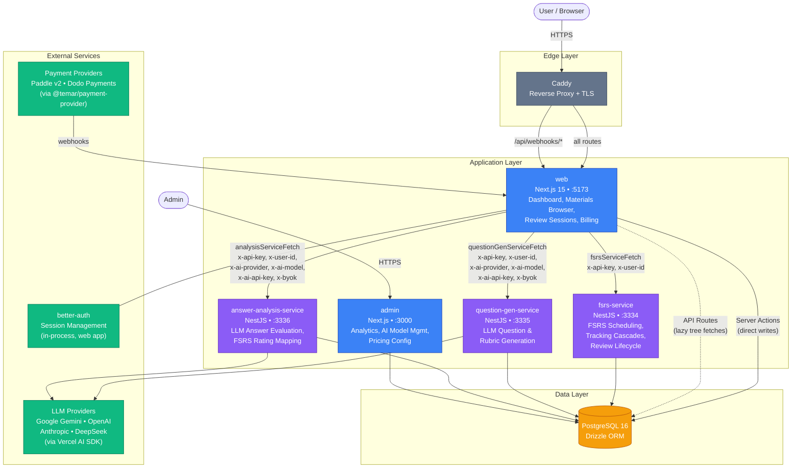
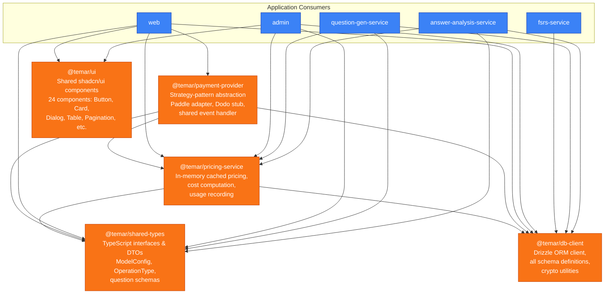

# System Architecture Overview

## 1. High-Level System Architecture



### Key architectural patterns

**Server-side-only service calls.** The web app communicates with NestJS microservices exclusively from the server (all fetch wrappers are marked `'use server'`). The browser never talks to backend services directly. This keeps API keys and service URLs out of client bundles.

**Stateless backend services.** The NestJS microservices have no user session awareness. Authentication is handled entirely by `better-auth` inside the Next.js app. Backend services authenticate callers via `x-api-key` and receive user identity through the `x-user-id` header.

**Dual data paths.** The web app accesses PostgreSQL in two ways:
1. **Server Actions** (`createChunk`, `updateChunkContent`, `deleteTopic`, etc.) write directly via `dbClient`.
2. **API Routes** (`/api/topics/[topicId]/notes`, `/api/notes/[noteId]/chunks`) serve lazy-loaded tree sidebar data via client-side `fetch()`.

**BYOK (Bring Your Own Key).** Users can supply their own LLM API keys. The web app forwards them to question-gen and answer-analysis services via `x-ai-provider`, `x-ai-model`, `x-ai-api-key`, and `x-byok` headers.

**Global API prefix.** All NestJS services use `app.setGlobalPrefix('api')`, so endpoint environment variables (e.g. `FSRS_SERVICE_API_ENDPOINT`) must include the `/api` suffix.

---

## 2. Shared Library Dependency Graph



### Library roles and relationships

| Library | Dependencies | Consumed by | Purpose |
|---|---|---|---|
| `@temar/shared-types` | None (leaf) | web, admin, question-gen, answer-analysis | Pure TypeScript types shared across the entire monorepo. Zero runtime dependencies. |
| `@temar/db-client` | None (leaf among `@temar/*`) | All 5 apps, pricing-service, payment-provider | Single source of truth for all Drizzle schema definitions. Exports `dbClient` singleton, table references, query operators (`eq`, `and`, `inArray`, `sql`), and crypto utilities (`encrypt`/`decrypt`). |
| `@temar/pricing-service` | db-client, shared-types | web, admin, question-gen, answer-analysis | In-memory cached pricing engine. Computes per-operation costs using active model pricing + markup configs, and records usage with balance deduction. |
| `@temar/payment-provider` | db-client, shared-types, pricing-service | web | Strategy-pattern abstraction that decouples billing logic from specific payment providers. Ships a Paddle adapter (production) and a Dodo Payments stub. The shared event handler normalizes webhook events and delegates to `pricing-service` for cost calculations. |
| `@temar/ui` | None (leaf) | web, admin | 24 shared shadcn/ui components (Button, Card, Dialog, Table, Pagination, etc.) with design-system fixes applied. Eliminates component duplication between web and admin. Requires Tailwind v4 `@source` directive in consuming apps' CSS. |

### Dependency layering

The libraries form a clean DAG with three leaf nodes:

```
shared-types (leaf)     db-client (leaf)      ui (leaf)
       \                   /    \              /    \
        \                 /      \            /      \
       pricing-service --+       |       web --+-- admin
              \                  |
               \                 |
            payment-provider ----+
```

`shared-types`, `db-client`, and `ui` are fully independent leaf nodes. `ui` is a pure frontend library with no `@temar/*` dependencies — it only depends on Radix UI, Tailwind utilities, and lucide-react. `pricing-service` depends on both `shared-types` and `db-client`. `payment-provider` sits at the top of the backend dependency chain. Schema changes in `db-client` can ripple through every library and application in the monorepo.
