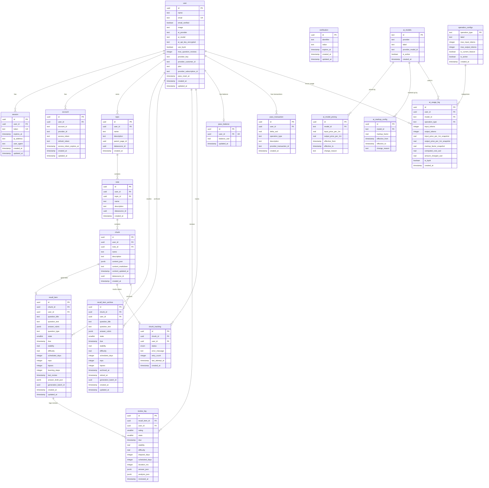

# Database Entity-Relationship Diagram

## ER Diagram

---

## Domain Groupings

### Auth (better-auth)

| Table | Purpose |
|-------|---------|
| `user` | Core user record; stores profile, AI preferences (BYOK), billing provider IDs, and plan tier |
| `session` | Active sessions with expiry, IP, and user-agent tracking |
| `account` | OAuth provider links (Google, GitHub, etc.) with token storage |
| `verification` | Email verification and password-reset tokens |

### Content Hierarchy

| Table | Purpose |
|-------|---------|
| `topic` | Top-level study subject owned by a user |
| `note` | A study note belonging to a topic |
| `chunk` | Atomic study unit within a note; stores content in **dual-storage model** (see below) |

### Spaced Repetition (FSRS)

| Table | Purpose |
|-------|---------|
| `recall_item` | Active FSRS card state for a chunk+user pair; holds question text, rubric, and all scheduling parameters (stability, difficulty, due date, reps, lapses) |
| `recall_item_archive` | Retired recall items preserved for historical analysis; mirrors `recall_item` columns plus `archived_at` and `retired_at` |
| `review_log` | Append-only log of every review event; captures rating, FSRS state snapshot, duration, answer content, and AI analysis |
| `chunk_tracking` | Tracks question-generation pipeline status per chunk+user (`pending` -> `generating` -> `ready`/`failed`/`untracked`) |

### Billing & Pricing

| Table | Purpose |
|-------|---------|
| `pass_balance` | 1:1 with user; current USD balance for Pass-based billing |
| `pass_transaction` | Append-only ledger of balance changes (top-ups, deductions, refunds) |
| `ai_models` | Master registry of available AI models across providers |
| `ai_model_pricing` | Versioned provider token pricing (input/output per 1M tokens); append-only with `effective_from`/`effective_to` |
| `ai_markup_config` | Versioned per-model markup factors applied on top of provider pricing; append-only |
| `operation_configs` | Defines operation types (question generation, answer analysis, etc.) with token budgets |
| `ai_usage_log` | Append-only audit trail of every AI call; denormalizes pricing snapshots for immutable cost records |

---

## Key Constraints and Patterns

### Dual-storage model (chunk)

Every chunk stores content in two columns:

- **`content_json`** (JSONB) -- Lexical `SerializedEditorState`, the source of truth for the rich-text editor
- **`content_markdown`** (text) -- derived via `lexicalToMarkdown()` at save time, used for AI prompts, review display, and full-text search

Both columns must be kept in sync on every content update.

### Append-only tables

The following tables are insert-only by design (no updates or deletes in application code):

- **`review_log`** -- immutable record of every review event
- **`ai_usage_log`** -- immutable audit trail with denormalized pricing snapshots
- **`ai_model_pricing`** -- old rows are closed (`effective_to` set) rather than updated; new rows inserted
- **`ai_markup_config`** -- same versioning pattern as `ai_model_pricing`
- **`pass_transaction`** -- immutable ledger of all balance mutations

### Unique constraints

- `recall_item` is unique on `(chunk_id, user_id)` -- one active card per chunk per user
- `chunk_tracking` is unique on `(chunk_id, user_id)` -- one tracking record per chunk per user
- `pass_balance` has a unique constraint on `user_id` -- exactly one balance row per user
- `user.email` is unique
- `ai_usage_log` has a unique index on `(user_id, created_at)` to prevent duplicate log entries

### Soft-delete / status-based lifecycle (chunk_tracking)

`chunk_tracking` uses a `status` enum (`pending`, `generating`, `ready`, `failed`, `untracked`) rather than hard deletion. When a user untracks a chunk, the status is set to `untracked` instead of deleting the row, preserving the generation history.

### Cascade deletes

All foreign keys referencing `user.id` use `ON DELETE CASCADE`, so deleting a user removes all associated data. Similarly:

- Deleting a `topic` cascades to its `note` rows
- Deleting a `note` cascades to its `chunk` rows
- Deleting a `chunk` cascades to `recall_item`, `recall_item_archive`, and `chunk_tracking`
- Deleting a `recall_item` cascades to `review_log`
- Deleting an `ai_models` row cascades to `ai_model_pricing` and `ai_markup_config`

### Nullable `user_id` on content tables

`topic.user_id`, `note.user_id`, and `chunk.user_id` are nullable (legacy from Notion sync era). User ownership in cascade operations (track note, track topic) is enforced at the `recall_item` level rather than filtering by `chunk.user_id`.

---

## Source Schema Files

- [`libs/db-client/src/schema/auth-schema.ts`](../../libs/db-client/src/schema/auth-schema.ts) -- `user`, `session`, `account`, `verification`
- [`libs/db-client/src/schema/pass-schema.ts`](../../libs/db-client/src/schema/pass-schema.ts) -- `pass_balance`, `pass_transaction`
- [`libs/db-client/src/schema/ai-pricing-schema.ts`](../../libs/db-client/src/schema/ai-pricing-schema.ts) -- `ai_models`, `ai_model_pricing`, `ai_markup_config`, `operation_configs`, `ai_usage_log`
- [`libs/db-client/src/schema/fsrs-schema.ts`](../../libs/db-client/src/schema/fsrs-schema.ts) -- `recall_item`, `recall_item_archive`, `review_log`, `chunk_tracking`
- [`libs/db-client/src/schema/notion-cache-schema.ts`](../../libs/db-client/src/schema/notion-cache-schema.ts) -- `topic`, `note`, `chunk`
