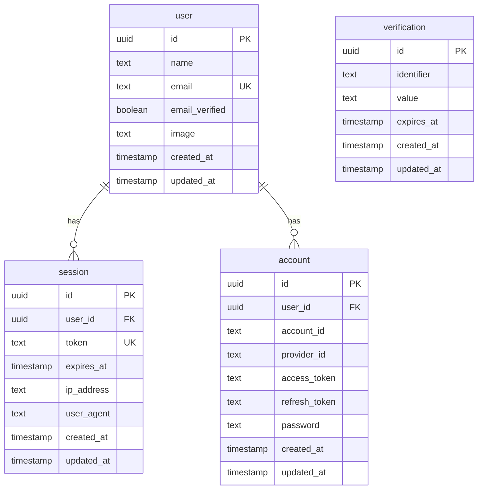
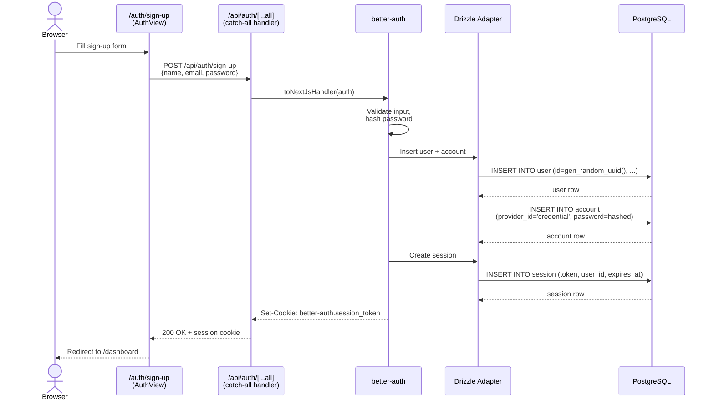
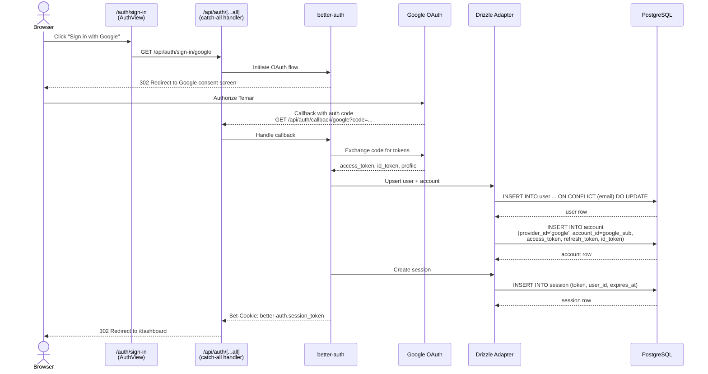
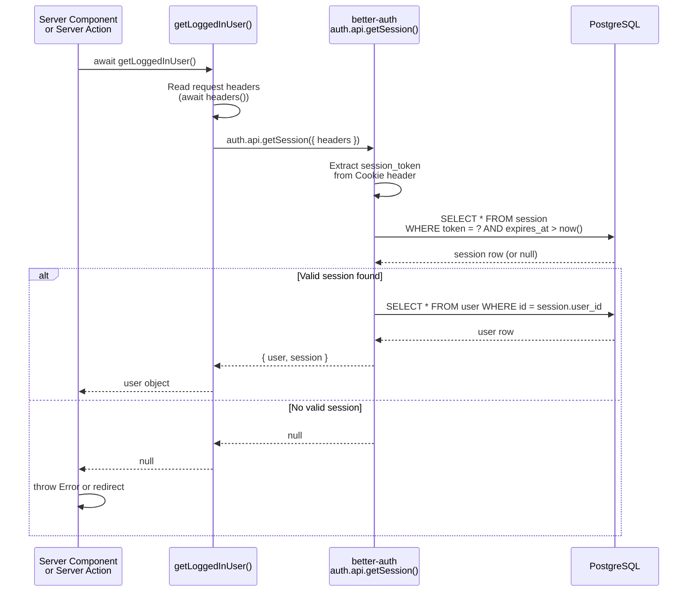
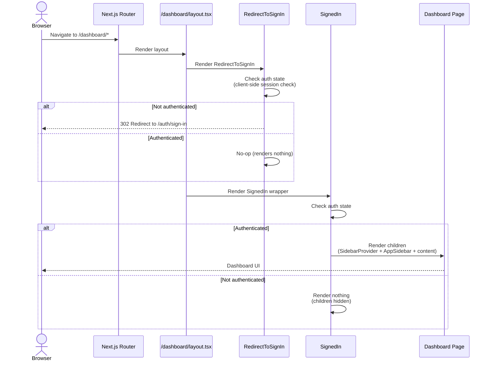

# Authentication Flow

## Overview

Temar uses [better-auth](https://www.better-auth.com/) with a Drizzle adapter for authentication. The auth system lives entirely within the Next.js web app -- backend microservices have no session awareness and authenticate callers via `x-api-key` headers.

**Providers:** Email/password signup, Google OAuth
**Session storage:** PostgreSQL via Drizzle (`session` table)
**Guard components:** `RedirectToSignIn` + `SignedIn` from `@daveyplate/better-auth-ui`

### Key Source Files

| File | Purpose |
|------|---------|
| `apps/web/src/lib/auth.ts` | `betterAuth()` config: Drizzle adapter, providers, UUID generation |
| `apps/web/src/lib/auth-client.ts` | Client-side `createAuthClient()` helper |
| `apps/web/src/app/api/auth/[...all]/route.ts` | Catch-all Next.js route handler (`toNextJsHandler`) |
| `apps/web/src/app/auth/[path]/page.tsx` | Auth pages (sign-in, sign-up, etc.) via `AuthView` |
| `apps/web/src/lib/fetchers/users.ts` | `getLoggedInUser()` -- server-side session reader |
| `apps/web/src/app/dashboard/layout.tsx` | Protected layout with `SignedIn` guard |
| `libs/db-client/src/schema/auth-schema.ts` | Schema: `user`, `session`, `account`, `verification` tables |

---

## Auth Tables

---

## 1. Email/Password Signup

---

## 2. Google OAuth

---

## 3. Session Validation (Server-Side)

---

## 4. Protected Routes (Dashboard Layout)

---

## Auth Configuration Summary

| Setting | Value |
|---------|-------|
| ID generation | `uuid` (via `gen_random_uuid()`) |
| Email/password | Enabled |
| Google OAuth | Enabled (env: `GOOGLE_CLIENT_ID`, `GOOGLE_CLIENT_SECRET`, `GOOGLE_OAUTH_REDIRECT_URI`) |
| Base URL | `BETTER_AUTH_URL` env var |
| Trusted origins | `BETTER_AUTH_TRUSTED_ORIGINS` (comma-separated) |
| Session cookie | `better-auth.session_token` (managed by better-auth) |
| User extra fields | `notionPageId` (optional, legacy from Notion sync) |

---

## Inter-Service Auth

Backend microservices (fsrs-service, question-gen-service, answer-analysis-service) do **not** participate in the session system. They authenticate incoming requests from the web app using:

- **`x-api-key`** header -- shared secret per service
- **`x-user-id`** header -- user identity forwarded by the web app after session validation
