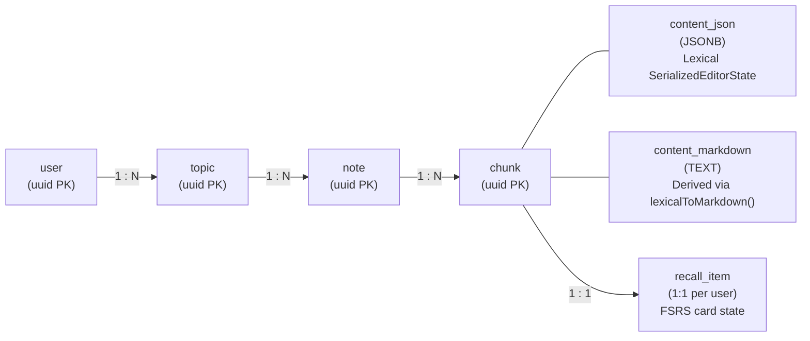
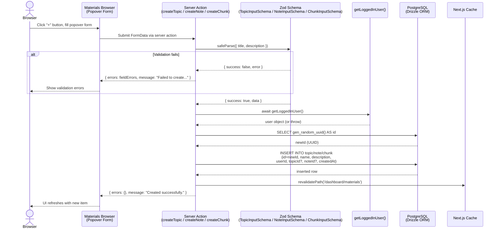
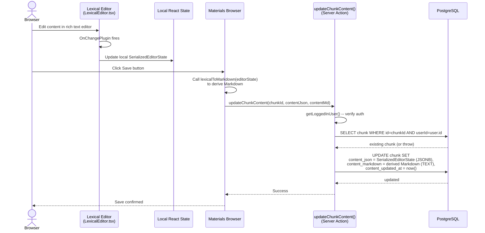
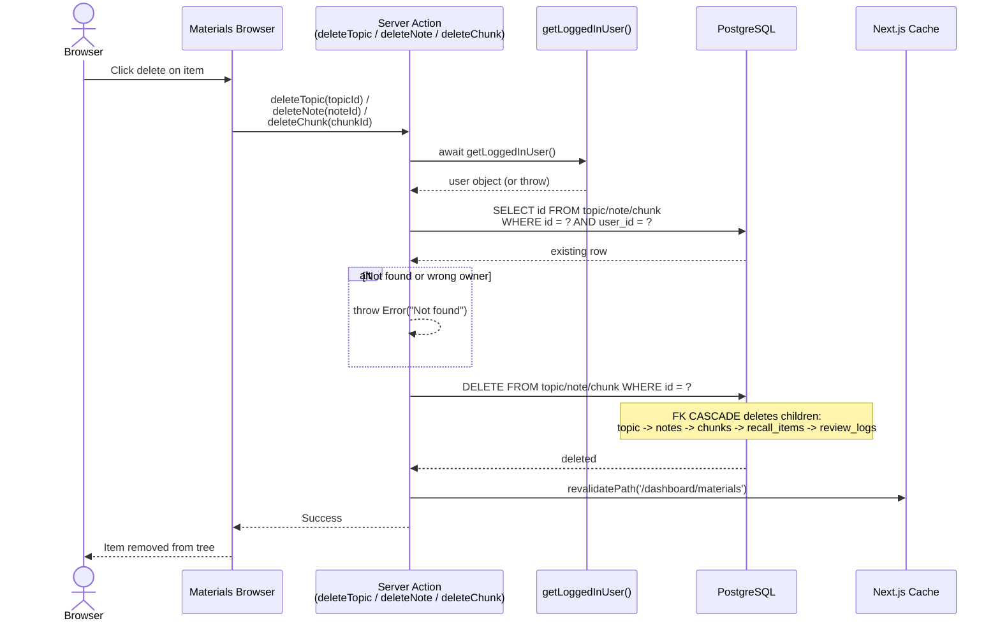
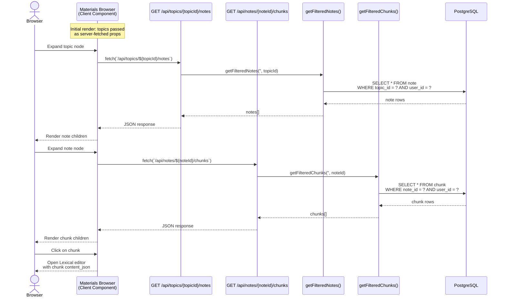

# Materials Management (CRUD)

## Overview

Study materials in Temar follow a three-level hierarchy: **Topic > Note > Chunk**. All entities are user-owned. Chunks hold the actual study content in a dual-storage model -- Lexical JSON for the editor and derived Markdown for AI consumption.

### Key Source Files

| File | Purpose |
|------|---------|
| `apps/web/src/lib/actions/topics.ts` | `createTopic()` server action |
| `apps/web/src/lib/actions/notes.ts` | `createNote()` server action |
| `apps/web/src/lib/actions/chunks.ts` | `createChunk()`, `updateChunkContent()` server actions |
| `apps/web/src/lib/actions/update.ts` | `updateTopic()`, `updateNote()`, `updateChunk()` metadata updates |
| `apps/web/src/lib/actions/delete.ts` | `deleteTopic()`, `deleteNote()`, `deleteChunk()` with cascade |
| `apps/web/src/app/api/topics/[topicId]/notes/route.ts` | Lazy-load notes under a topic (GET) |
| `apps/web/src/app/api/notes/[noteId]/chunks/route.ts` | Lazy-load chunks under a note (GET) |
| `apps/web/src/app/dashboard/materials/_components/materials-browser.tsx` | Tree UI component |
| `apps/web/src/components/lexical-editor/LexicalEditor.tsx` | Rich text editor (Lexical) |
| `apps/web/src/components/lexical-editor/utils/serialize.ts` | `lexicalToMarkdown()` converter |
| `libs/db-client/src/schema/notion-cache-schema.ts` | `topic`, `note`, `chunk` table definitions |

---

## 1. Data Hierarchy



### Foreign Key Cascades

All parent-child relationships use `ON DELETE CASCADE`:

```
user -> topic -> note -> chunk -> recall_item -> review_log
```

Deleting a topic removes all its notes, chunks, recall items, and review logs.

---

## 2. Create Flow



---

## 3. Content Editing (Chunk Dual Storage)



### Dual Storage Model

| Column | Type | Purpose |
|--------|------|---------|
| `content_json` | `JSONB` | Lexical `SerializedEditorState` -- source of truth for the editor |
| `content_markdown` | `TEXT` | Derived via `lexicalToMarkdown()` at save time -- used for AI prompts, review display, and search |

The `lexicalToMarkdown()` function handles: headings, paragraphs, lists, code blocks, tables, blockquotes, horizontal rules, images, equations (LaTeX), Mermaid diagrams, YouTube embeds, collapsible sections, and inline formatting (bold, italic, code, strikethrough, highlight).

---

## 4. Delete Flow



---

## 5. Lazy-Loading Tree (Sidebar)

The materials browser tree loads children on demand: topics are fetched initially, then notes and chunks are loaded when a parent node is expanded.



---

## Update Flow (Metadata)

For renaming or updating descriptions (not content), the `updateTopic()`, `updateNote()`, and `updateChunk()` server actions follow the same pattern:

1. `getLoggedInUser()` -- verify authentication
2. `SELECT` to verify ownership (`WHERE id = ? AND user_id = ?`)
3. `UPDATE ... SET name, description WHERE id = ?`
4. `revalidatePath('/dashboard/materials')`

These actions are triggered from the `EditDialog` component in the materials browser.
