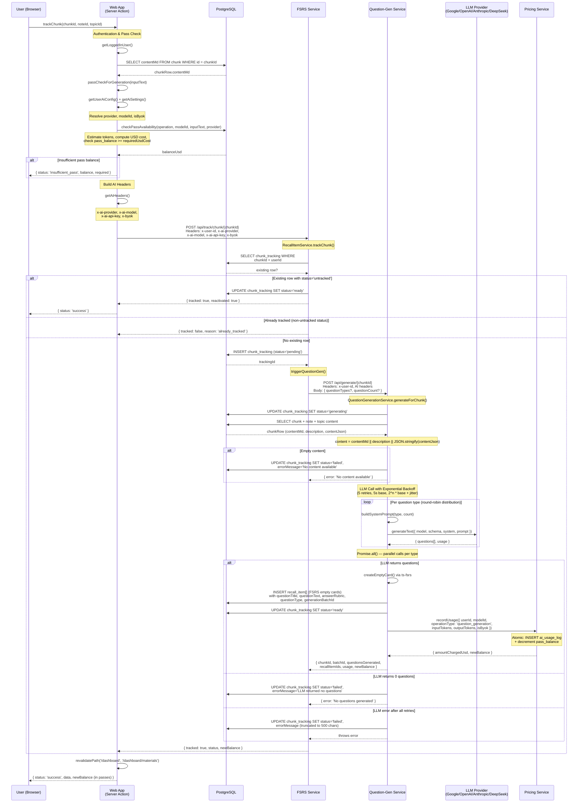
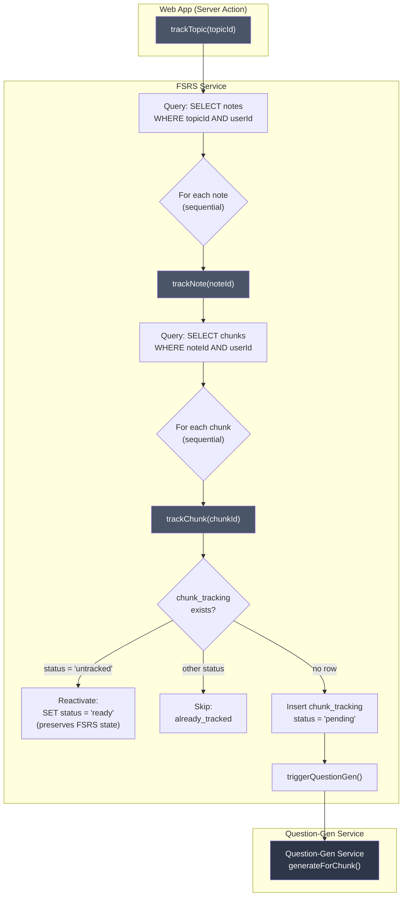
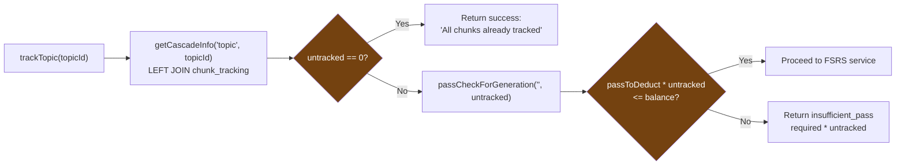
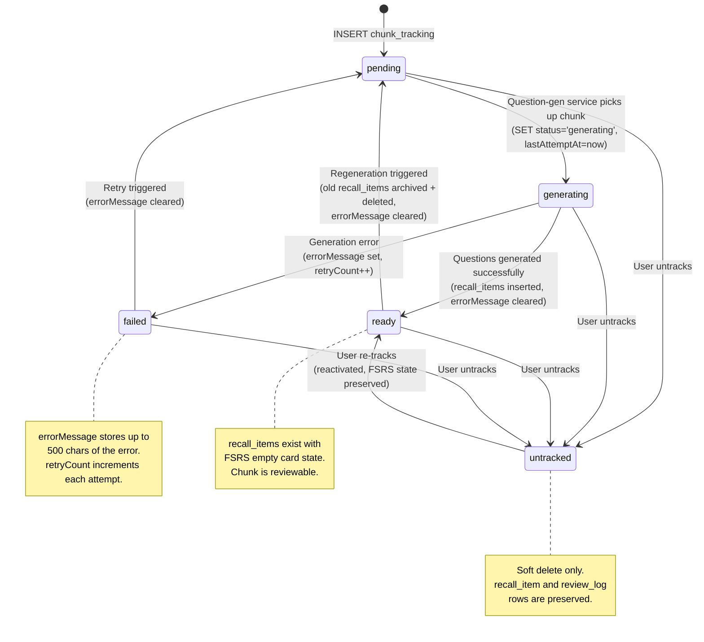
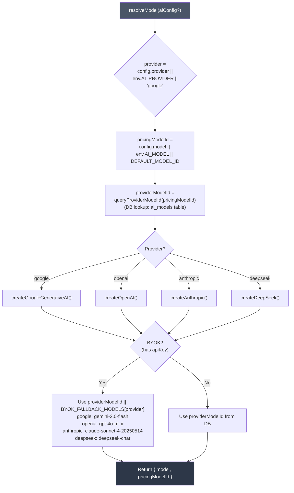
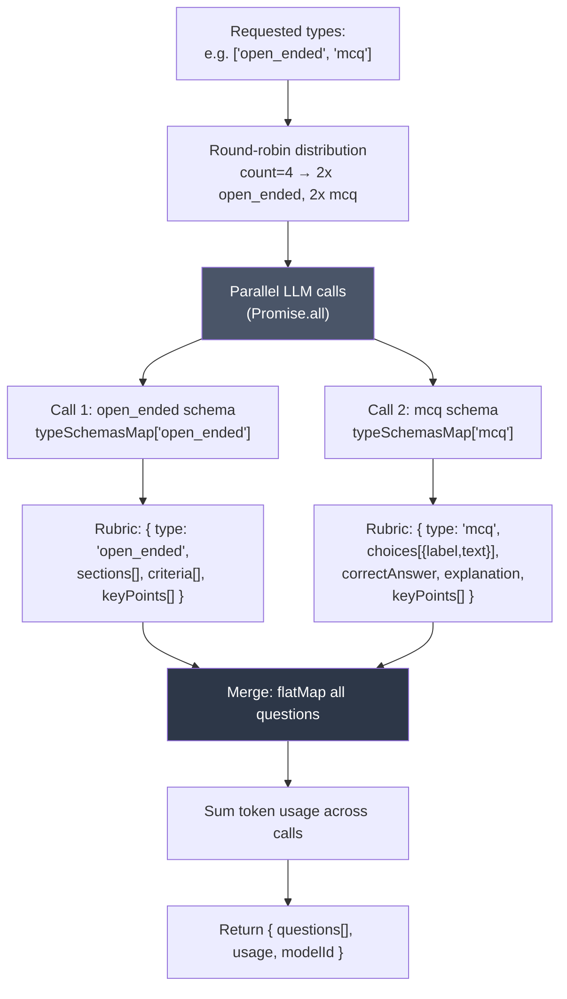

# Tracking & Question Generation Flow

This document covers the full lifecycle of tracking chunks for spaced repetition, generating questions via LLM, cascade operations, and regeneration with performance-aware prompting.

---

## 1. Main Tracking Flow

When a user clicks "Track" on a chunk in the Materials Browser, the following chain executes synchronously across three services.



---

## 2. Cascade Operations

Topic and note tracking fan out to individual chunk tracking calls sequentially.



### Pass pre-check at the web layer

Before cascade operations reach the FSRS service, the web app counts **only untracked chunks** (via `getCascadeInfo()`) and estimates the pass cost for those. Already-tracked chunks are excluded from the cost estimate.



### Per-chunk tracking mode

When cascade tracking a topic or note, the UI offers two modes:

- **Same for all** (default): A single set of question types and count is applied to all new chunks via the cascade endpoint (`trackTopic`/`trackNote`).
- **Per chunk**: The user configures question types and count individually for each untracked chunk. The web app calls `trackChunksBatch()`, which tracks each chunk individually via separate `POST /api/track/chunk/{chunkId}` calls with per-chunk `questionTypes` and `questionCount`.

Already-tracked chunks are shown in the UI with an emerald indicator and are always skipped — they retain their existing question types and FSRS state.

---

## 3. Tracking Status Lifecycle

The `chunk_tracking.status` column governs the generation pipeline state machine.



---

## 4. Regeneration Flow

When a user regenerates questions for a chunk (e.g., after all questions are retired or content has changed), the system preserves review history as a performance summary to guide the LLM toward the user's weak areas.

```mermaid
sequenceDiagram
    participant U as User (Browser)
    participant W as Web App<br/>(Server Action)
    participant F as FSRS Service
    participant DB as PostgreSQL
    participant Q as Question-Gen Service
    participant LLM as LLM Provider
    participant P as Pricing Service

    U->>W: regenerateChunkQuestions(chunkId)

    W->>W: getLoggedInUser()
    W->>DB: SELECT contentMd FROM chunk
    W->>W: passCheckForGeneration(inputText)

    alt Insufficient pass
        W-->>U: { status: 'insufficient_pass' }
    end

    W->>W: getAiHeaders()
    W->>F: POST /api/track/regenerate/{chunkId}<br/>Headers: x-user-id, AI headers

    Note over F: RecallItemService.regenerateChunk()

    rect rgb(60, 60, 80)
        Note over F,DB: Step 1: Build Performance Summary<br/>(BEFORE deleting — review_log cascades on delete)
        F->>DB: SELECT * FROM recall_item<br/>WHERE chunkId AND userId
        DB-->>F: items[]
        F->>DB: SELECT * FROM review_log<br/>WHERE recallItemId IN (itemIds)
        DB-->>F: logs[]

        Note over F: Compute per-question breakdown:<br/>- Rating distribution (Again/Hard/Good/Easy)<br/>- Knowledge level (STRONG/MODERATE/DEVELOPING/WEAK)<br/>- Good+Easy ratio, total lapses<br/>- Per-question: ratings, reps, lapses, stability<br/>- Strengths & weaknesses from analysisJson
    end

    rect rgb(80, 50, 50)
        Note over F,DB: Step 2: Archive & Delete Old Items
        F->>DB: INSERT INTO recall_item_archive<br/>(...oldItems, retiredAt=now)
        F->>DB: DELETE FROM recall_item<br/>WHERE chunkId AND userId
        Note over DB: CASCADE: review_log rows deleted
    end

    rect rgb(50, 70, 50)
        Note over F,DB: Step 3: Reset Tracking & Trigger Generation
        F->>DB: UPDATE chunk_tracking<br/>SET status='pending', errorMessage=null
        F->>Q: POST /api/generate/{chunkId}<br/>Body: { performanceSummary }
    end

    Note over Q: generateForChunk() with performanceSummary

    Q->>DB: UPDATE chunk_tracking SET status='generating'
    Q->>DB: SELECT chunk content
    Q->>Q: buildSystemPrompt() + performance context

    Note over Q: System prompt appends:<br/>"## Previous Performance Context"<br/>- WEAK → foundational questions<br/>- MODERATE → deeper connections<br/>- STRONG → synthesis & edge cases<br/>- Target identified GAPS<br/>- Avoid mastered questions<br/>- Vary angles from previous round

    Q->>LLM: generateText({ system: prompt + perfContext,<br/>prompt: content + performanceSummary })
    LLM-->>Q: { questions[], usage }

    Q->>DB: INSERT new recall_item[] (fresh FSRS cards)
    Q->>DB: UPDATE chunk_tracking SET status='ready'
    Q->>P: recordUsage()
    P-->>Q: { newBalance }
    Q-->>F: { chunkId, status, newBalance }
    F-->>W: { chunkId, status, newBalance }
    W-->>U: { status: 'success', newBalance (in passes) }
```



### Performance Summary Structure

The `buildPerformanceSummary()` method produces a structured text block passed to the LLM:

```
## User Performance Summary
Overall knowledge level: MODERATE
Total reviews: 14 | Rating distribution: Again=2, Hard=3, Good=7, Easy=2
Total lapses: 3 | Good+Easy ratio: 64%

### Per-Question Breakdown
- Q: "Explain Variable Declaration" | Ratings: [Good, Hard, Good] | Reps: 3, Lapses: 0, Stability: 12.5d
  Strengths: Understands basic syntax; Provides examples
  Weaknesses: Misses scope rules
- Q: "Compare let vs const" | Ratings: [Again, Hard, Good] | Reps: 3, Lapses: 1, Stability: 4.2d
  Weaknesses: Confuses block vs function scope; Omits temporal dead zone
```

Knowledge level thresholds:
- **STRONG**: Good+Easy ratio >= 80% AND total lapses <= 1
- **MODERATE**: Good+Easy ratio >= 60%
- **DEVELOPING**: Good+Easy ratio >= 35%
- **WEAK**: Good+Easy ratio < 35%

---

## 5. LLM Provider Resolution

The `LlmService.resolveModel()` method maps user configuration to a concrete AI SDK model instance.



---

## 6. Question Type Schema (Structured Output)

The LLM uses `z.discriminatedUnion` on the `type` field to produce type-safe rubrics. Per-type schemas lock each LLM call to a single question type.



**Question types:**

| Type | Rubric Fields | Notes |
|------|--------------|-------|
| `open_ended` | `sections`, `criteria` (visible), `keyPoints` (hidden) | criteria must NOT reveal answers |
| `mcq` | `choices` (4x A-D), `correctAnswer`, `explanation`, `keyPoints` | explanation hidden until after answering |
| `leetcode` | `functionPrototype`, `examples` (2-3), `constraints`, `keyPoints` | LeetCode-style coding problems |

---

## Key Source Files

| File | Purpose |
|------|---------|
| `apps/web/src/lib/actions/tracking.ts` | Server actions: trackChunk/Note/Topic, trackChunksBatch, getCascadeInfo, untrack, regenerate |
| `apps/web/src/components/tracking-button.tsx` | TrackingButton UI with cascade info, batch/per-chunk mode toggle |
| `apps/web/src/lib/actions/pass.ts` | checkPassAvailability, balance queries |
| `apps/web/src/lib/actions/ai-settings.ts` | getAiHeaders, getUserAiConfig |
| `apps/fsrs-service/src/app/services/recall-item.service.ts` | trackChunk, cascades, regenerateChunk, buildPerformanceSummary |
| `apps/question-gen-service/src/app/services/question-generation.service.ts` | generateForChunk, retry logic, batch generation |
| `apps/question-gen-service/src/app/services/llm.service.ts` | resolveModel, buildSystemPrompt, generateQuestions, structured output schemas |
| `libs/pricing-service/src/lib/pricing-service.ts` | recordUsage (atomic: ai_usage_log + pass_balance decrement) |
