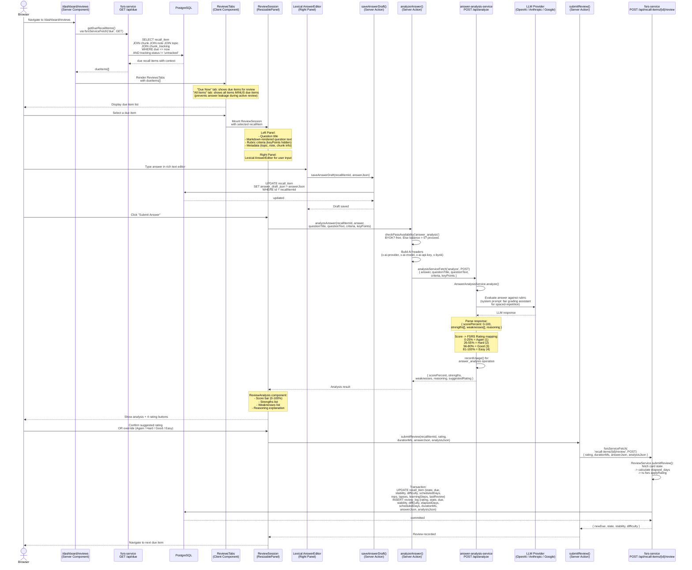

# Review Session Lifecycle

## Overview

A review session is the core learning loop in Temar. The user sees due items, answers AI-generated questions via a Lexical editor, receives AI-graded feedback, and confirms or overrides the suggested FSRS rating. Each completed review updates the spaced-repetition schedule for the next appearance.

### Key Source Files

| File | Purpose |
|------|---------|
| `apps/web/src/app/dashboard/reviews/_components/review-session.tsx` | ReviewSession component -- ResizablePanel layout for question + answer |
| `apps/web/src/app/dashboard/reviews/_components/reviews-tabs.tsx` | Tab switching ("Due Now" / "All Items") + due item filtering |
| `apps/web/src/lib/actions/analysis.ts` | `analyzeAnswer()` server action |
| `apps/web/src/lib/actions/review.ts` | `submitReview()`, `saveAnswerDraft()` server actions |
| `apps/web/src/lib/fetchers/recall-items.ts` | `getDueRecallItems()`, `getAllRecallItems()` fetchers |
| `apps/answer-analysis-service/src/app/services/answer-analysis.service.ts` | LLM answer evaluation against rubric |
| `apps/answer-analysis-service/src/app/services/llm.service.ts` | LLM provider abstraction for analysis |
| `apps/fsrs-service/src/app/services/review.service.ts` | `submitReview()` -- FSRS state transition + review_log insert |

---

## Full Review Cycle

---

## Score-to-Rating Mapping

| Score Range | FSRS Rating | Label | Effect |
|-------------|-------------|-------|--------|
| 0--25% | 1 | Again | Card enters Learning/Relearning, short interval |
| 26--55% | 2 | Hard | Slightly reduced interval growth |
| 56--80% | 3 | Good | Normal interval progression |
| 81--100% | 4 | Easy | Accelerated interval, higher stability |

The user always sees the AI-suggested rating but can override it before submission. The override is what gets sent to the FSRS engine.

---

## Due Item Filtering (Answer Leakage Prevention)

The ReviewsTabs component maintains two views:

- **Due Now**: Items where `due <= now` and `tracking.status != 'untracked'` -- these are actively reviewable.
- **All Items**: All tracked recall items EXCLUDING those currently due. This prevents a user from seeing an item's full details (chunk content, previous answers) in the "All Items" tab while that same item is waiting to be reviewed in "Due Now".

---

## Auto-Save Draft

While the user is writing an answer, the editor periodically calls `saveAnswerDraft()` which writes the current Lexical editor state directly to `recall_item.answer_draft_json`. This allows the user to resume an interrupted review session without losing their in-progress answer.
