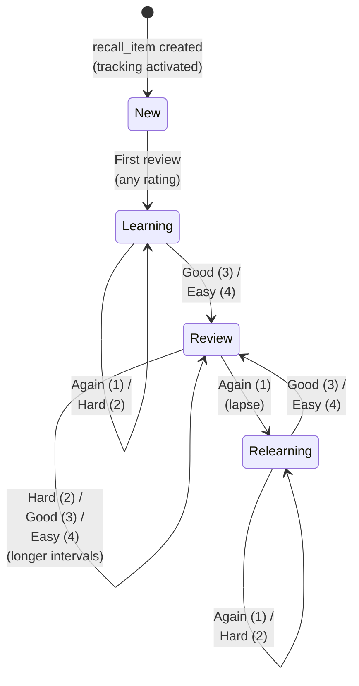
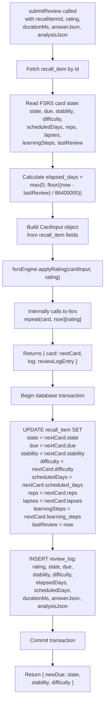
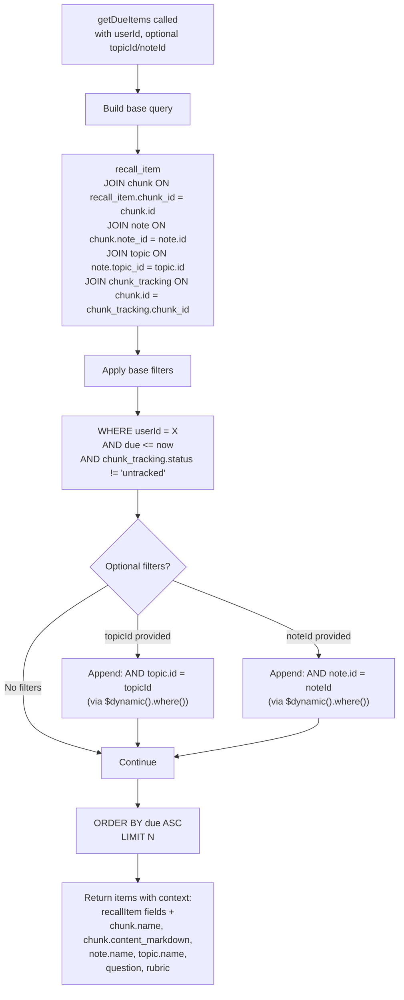
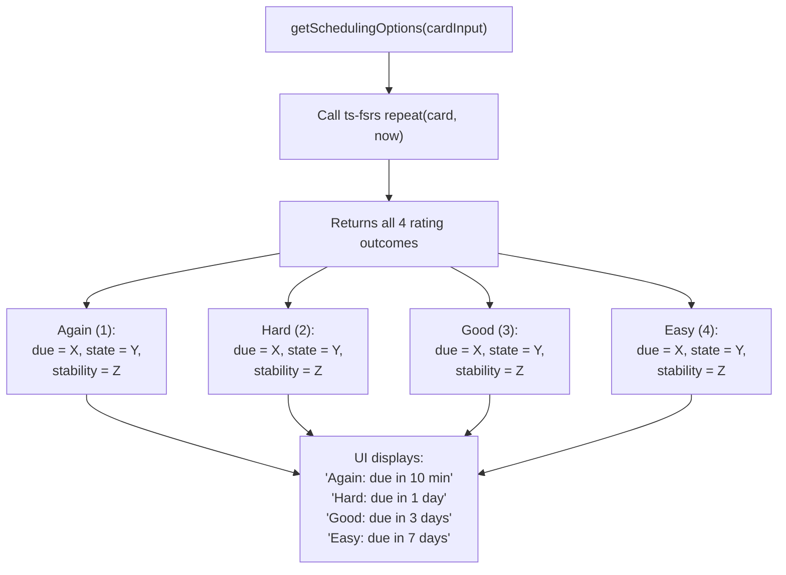

# FSRS Scheduling Engine

## Overview

Temar uses the [Free Spaced Repetition Scheduler (FSRS)](https://github.com/open-spaced-repetition/ts-fsrs) algorithm to determine when each recall item should next be reviewed. The fsrs-service wraps the `ts-fsrs` library and manages card state transitions, review logging, and due-item queries.

### Key Source Files

| File | Purpose |
|------|---------|
| `apps/fsrs-service/src/app/services/fsrs-engine.service.ts` | ts-fsrs wrapper -- `applyRating()`, `getSchedulingOptions()` |
| `apps/fsrs-service/src/app/services/review.service.ts` | `submitReview()` transaction -- state update + review_log insert |
| `apps/fsrs-service/src/app/services/recall-item.service.ts` | `getDueItems()`, `getAllItems()` queries |
| `apps/fsrs-service/src/app/controllers/schedule.controller.ts` | Schedule preview endpoints |
| `apps/fsrs-service/src/app/controllers/review.controller.ts` | Review submission endpoints |

---

## 1. FSRS State Machine

Each recall item exists in one of four states. Transitions depend on the user's rating after each review.



### State Descriptions

| State | Code | Description |
|-------|------|-------------|
| New | 0 | Initial state when a recall_item is created via tracking activation. No reviews yet. |
| Learning | 1 | Card has been reviewed at least once but is not yet mature. Short intervals. |
| Review | 2 | Mature card with stable recall. Intervals grow with each successful review. |
| Relearning | 3 | Previously mature card that was failed (rated Again). Returns to short intervals until recovered. |

---

## 2. applyRating Flow

When a user submits a review, the fsrs-service calculates the next scheduling state.



### Card Fields Updated Per Review

| Field | Description |
|-------|-------------|
| `state` | New (0), Learning (1), Review (2), or Relearning (3) |
| `due` | Next review datetime |
| `stability` | Memory stability (higher = longer intervals) |
| `difficulty` | Card difficulty (0--10 scale, higher = harder) |
| `scheduledDays` | Days until next review |
| `reps` | Total number of successful reviews |
| `lapses` | Number of times the card was forgotten (rated Again from Review state) |
| `learningSteps` | Current position in learning/relearning step sequence |
| `lastReview` | Timestamp of this review |

---

## 3. getDueItems Query

The due items query retrieves recall items that are ready for review, with full context for display.



> **Important:** Each `.where()` call on a `$dynamic()` query **replaces** the previous filter. All conditions must be accumulated in an array and applied as a single `.where(and(...conditions))` call. See [Critical Build Gotchas](../../CLAUDE.md) for details.

---

## 4. Scheduling Preview

Before the user confirms a rating, the UI can show what each rating would produce. This lets the user make an informed override decision.



The `getSchedulingOptions()` method calls `ts-fsrs repeat()` once, which internally computes all four possible outcomes. The UI formats the `due` timestamps as relative durations ("in 10 minutes", "in 3 days", etc.) and displays them on the four rating buttons.

---

## Review Log (Append-Only)

Every review creates an immutable `review_log` entry. This provides a complete audit trail of the user's learning history and enables future analytics (retention curves, difficulty trends, session duration tracking).

```
recall_item (1) ---- (N) review_log
```

Each `review_log` entry captures the rating, the full FSRS state at review time, elapsed/scheduled days, session duration, the user's answer (as Lexical JSON), and the AI analysis result. Logs are never updated or deleted.
