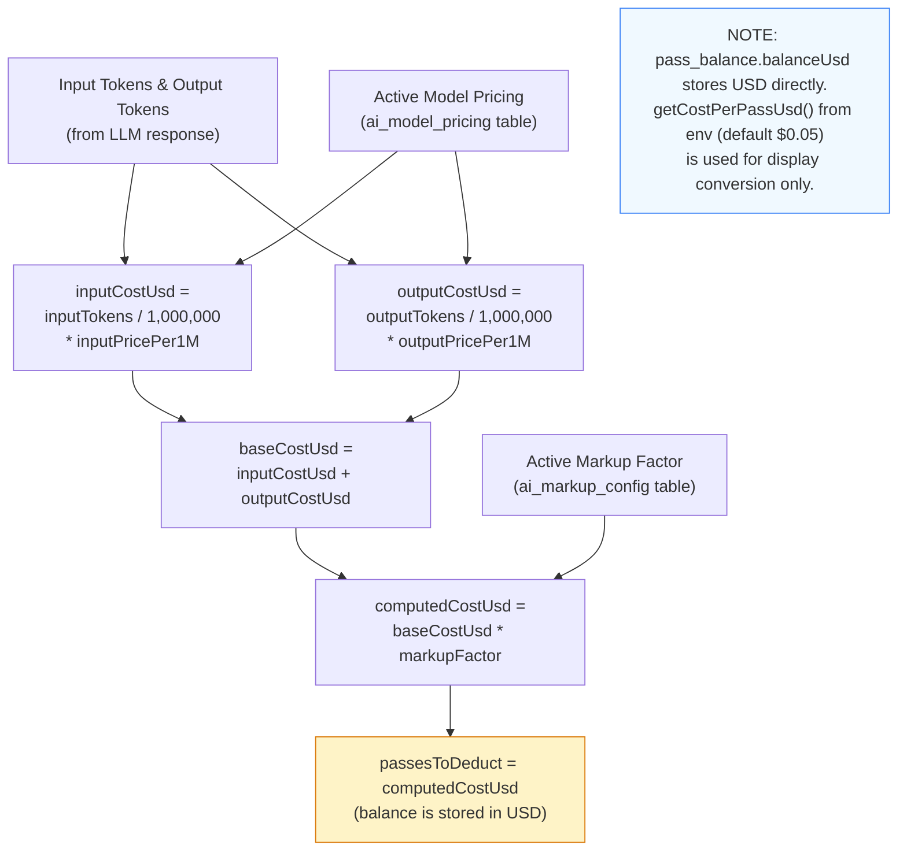
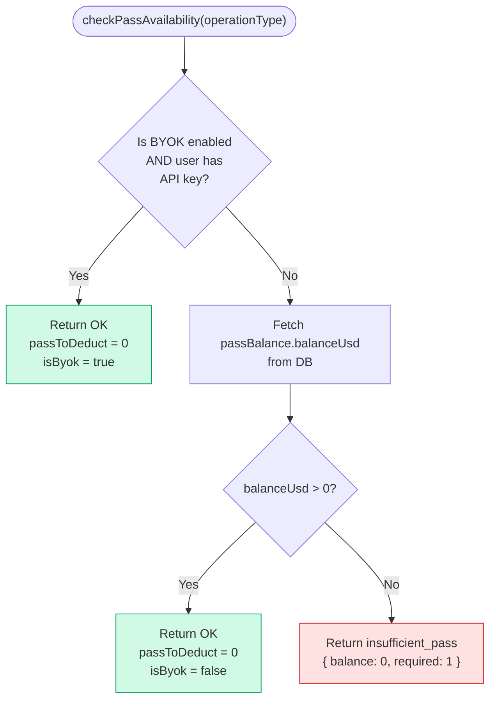
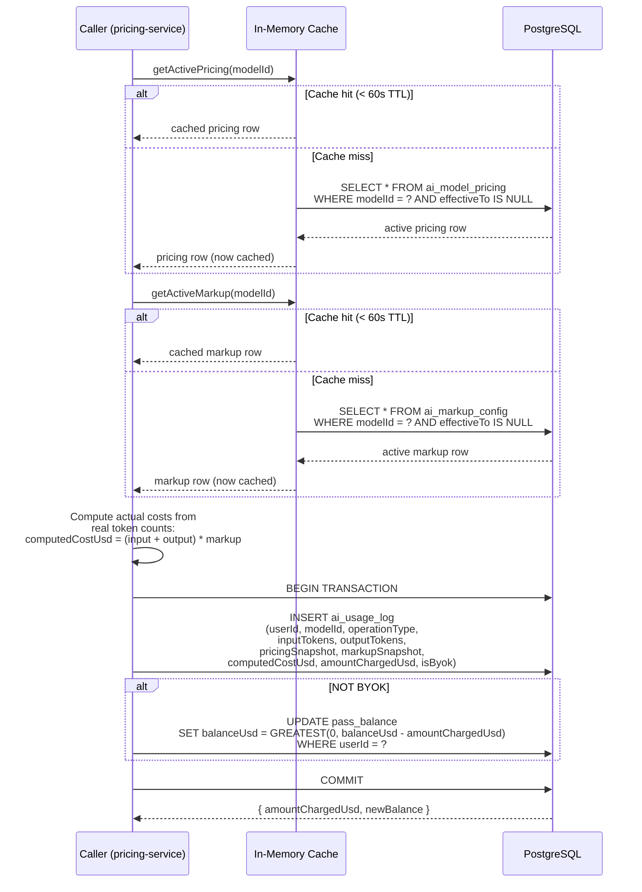
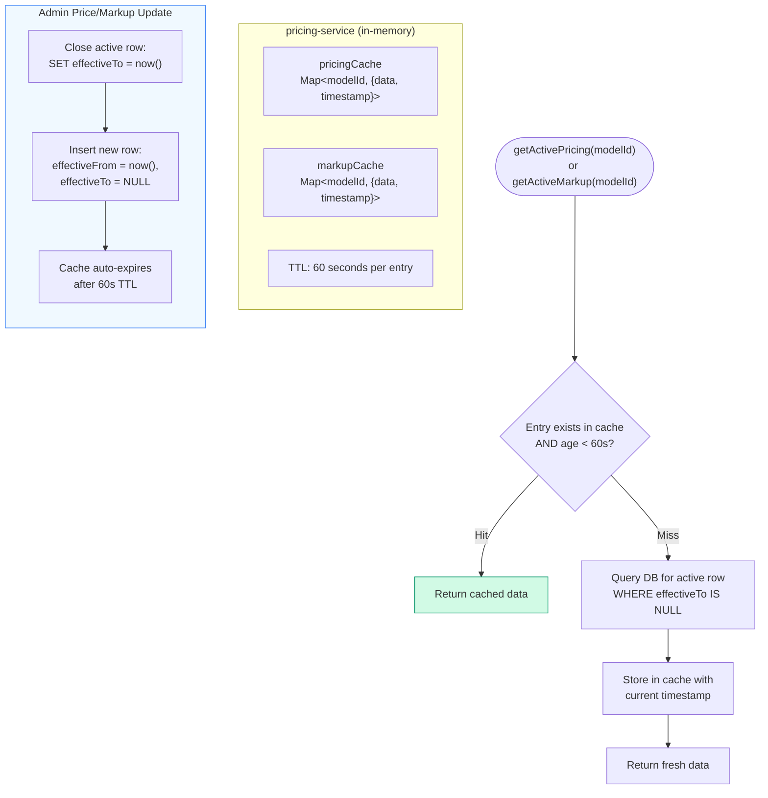

# Pass-Based Billing

## 1. Cost Computation Formula

## 2. checkPassAvailability Flow

The pre-check is intentionally simple — no cost estimation. Actual costs are deducted after LLM calls via `recordUsage()`.

## 3. recordUsage Flow

## 4. Pricing Cache Architecture

---

## Key Source Files

| File | Purpose |
|------|---------|
| `apps/web/src/lib/actions/pass.ts` | checkPassAvailability, getPassBalance, creditPass |
| `libs/pricing-service/src/lib/pricing-service.ts` | recordUsage, getActivePricing, getActiveMarkup, cache |
| `libs/db-client/src/lib/ai-pricing-queries.ts` | queryActivePricing, queryActiveMarkup, insertUsageLog, decrementUserPassBalance |
| `libs/db-client/src/schema/pass-schema.ts` | pass_balance, pass_transaction |
| `libs/db-client/src/schema/ai-pricing-schema.ts` | ai_model_pricing, ai_markup_config, ai_usage_log, operation_configs |
