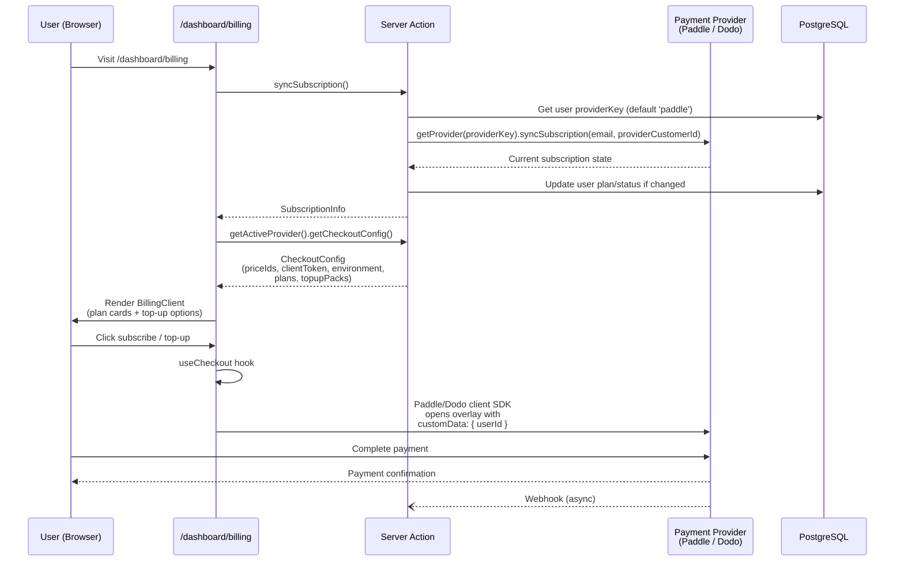
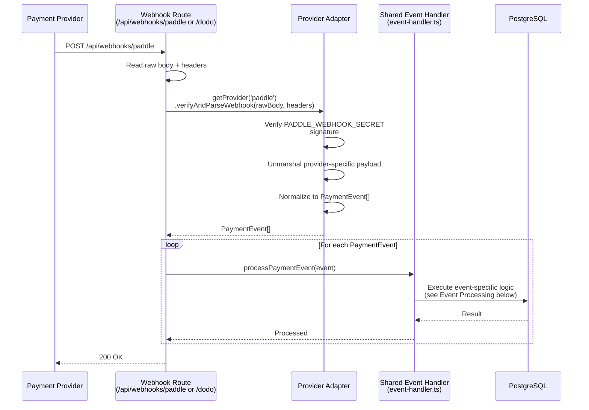
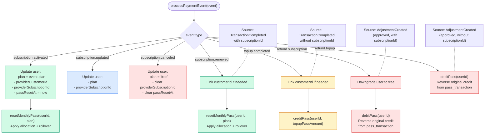
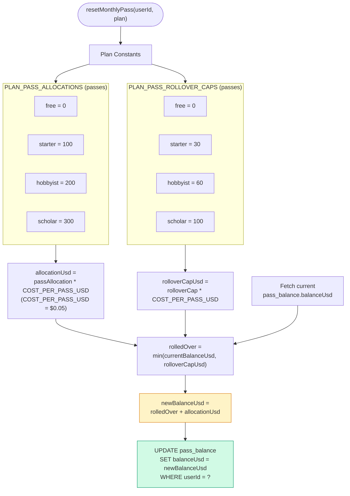
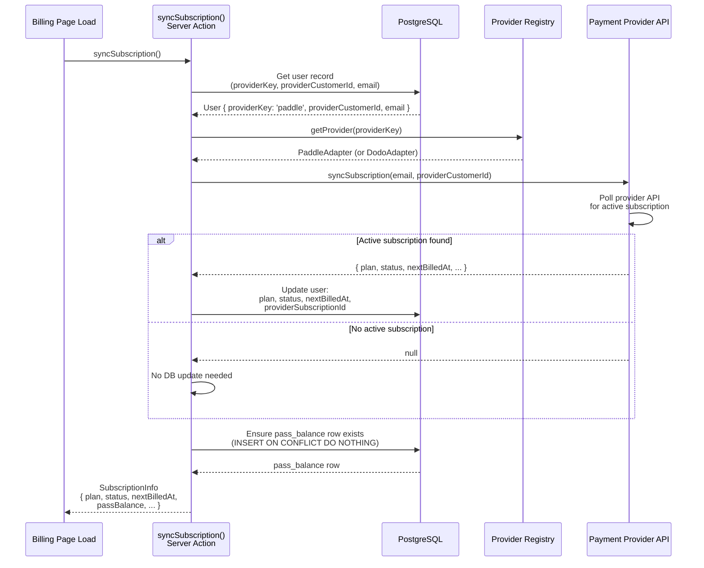

# Payment & Subscription Lifecycle

## 1. Checkout Flow

## 2. Webhook Processing

## 3. Event Processing

## 4. Monthly Pass Reset & Rollover

### Example: Hobbyist Plan Reset

| Step | Passes | USD ($0.05/pass) |
|------|--------|-------------------|
| Current balance | 150 passes | $7.50 |
| Rollover cap | 60 passes | $3.00 |
| Rolled over | min(150, 60) = 60 | $3.00 |
| Monthly allocation | +200 | +$10.00 |
| **New balance** | **260 passes** | **$13.00** |

## 5. syncSubscription Flow

---

## Key Source Files

| File | Purpose |
|------|---------|
| `apps/web/src/app/api/webhooks/paddle/route.ts` | Thin webhook route for Paddle |
| `apps/web/src/app/api/webhooks/dodo/route.ts` | Dodo webhook stub |
| `libs/payment-provider/src/lib/event-handler.ts` | processPaymentEvent, resetMonthlyPass, creditPass, debitPass |
| `libs/payment-provider/src/lib/adapters/paddle/paddle-adapter.ts` | Paddle implementation |
| `libs/payment-provider/src/lib/adapters/paddle/paddle-plans.ts` | Plan mappings |
| `libs/payment-provider/src/lib/types.ts` | PaymentEvent, CheckoutConfig, SubscriptionInfo |
| `libs/payment-provider/src/lib/registry.ts` | getProvider, getActiveProvider |
| `apps/web/src/lib/actions/subscription-sync.ts` | syncSubscription server action |
| `apps/web/src/hooks/use-checkout.ts` | Client-side checkout hook |
| `apps/web/src/app/dashboard/billing/_components/billing-client.tsx` | Billing UI |
