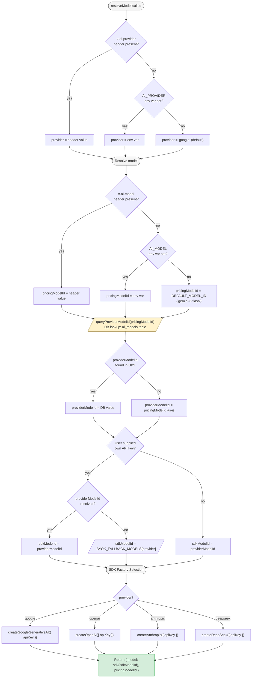
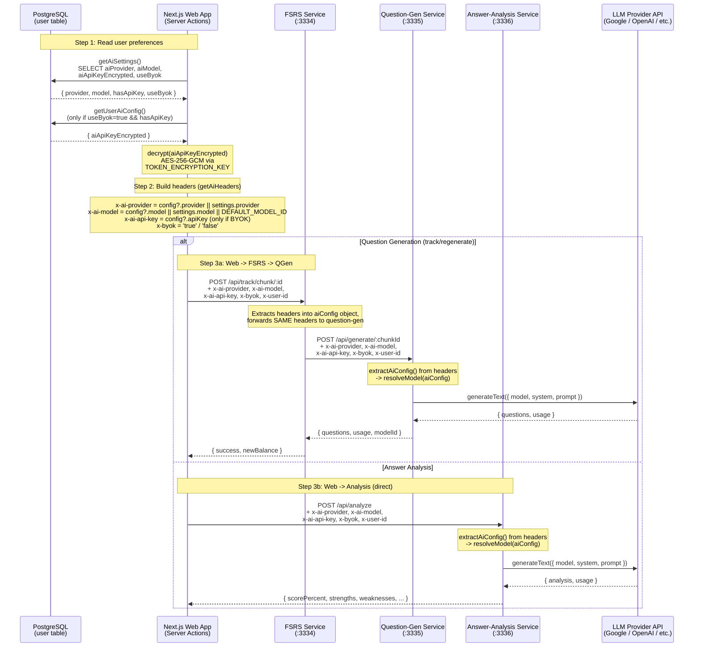
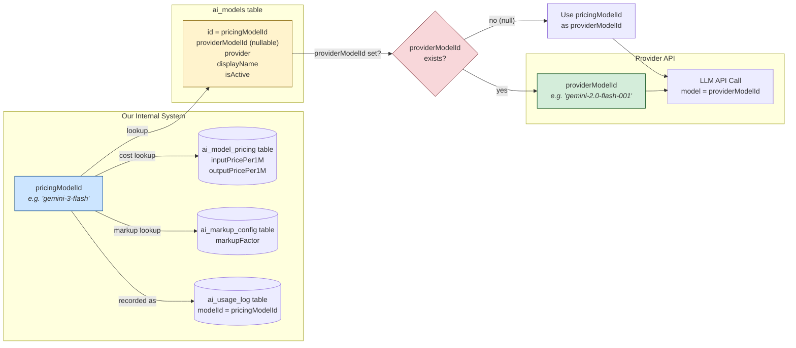

# 10 -- AI Provider Routing

How the platform resolves which LLM provider, model, and API key to use for
question generation and answer analysis, and how those choices propagate from
the web app through the microservice chain.

---

## 1. Provider Resolution Chain

Both `question-gen-service` and `answer-analysis-service` share an identical
`resolveModel()` method in their respective `LlmService` classes. The logic
below applies to both.

### BYOK Fallback Models

When a user provides their own API key (`x-ai-api-key` header) but no explicit
model was resolved from the DB, the service falls back to a sensible default
per provider:

| Provider    | Fallback Model               |
|-------------|------------------------------|
| `google`    | `gemini-2.0-flash`           |
| `openai`    | `gpt-4o-mini`                |
| `anthropic` | `claude-sonnet-4-20250514`   |
| `deepseek`  | `deepseek-chat`              |

### SDK Factory Selection

Each provider maps to a dedicated `@ai-sdk/*` package constructor. Notably,
DeepSeek uses its own `@ai-sdk/deepseek` package (`createDeepSeek`) rather than
`createOpenAI` with a custom `baseURL` -- the latter was broken in AI SDK v5.

---

## 2. Header Propagation Chain

The full journey of AI configuration from user preferences in the database to
the final LLM API call.

### Key Points

- **Provider fallback**: `getAiHeaders()` uses `config?.provider || settings.provider`,
  meaning even when BYOK is off, the user's selected provider preference (from
  settings) is still sent. This allows non-BYOK users to choose a provider while
  using platform-managed API keys.

- **Model always sent**: `x-ai-model` always has a value (falls back to
  `DEFAULT_MODEL_ID = 'gemini-3-flash'`), ensuring services can always record
  usage against a known pricing model.

- **API key only when BYOK**: `getUserAiConfig()` returns `undefined` entirely
  when `useByok` is false or no encrypted key exists. The `x-ai-api-key` header
  is only set when a decrypted key is available.

- **FSRS is a pass-through**: The FSRS service does not interpret AI config; it
  extracts headers into an `aiConfig` object and forwards them identically when
  calling question-gen-service.

---

## 3. Dual Model ID System (pricingModelId vs providerModelId)

The platform maintains two distinct model identifiers to decouple billing from
provider API details.

### Why Two IDs?

| Concept | `pricingModelId` | `providerModelId` |
|---|---|---|
| **Purpose** | Internal billing and cost tracking | Actual model name sent to provider API |
| **Example** | `gemini-3-flash` | `gemini-2.0-flash-001` |
| **Stored in** | `ai_usage_log.modelId`, headers, settings | `ai_models.providerModelId` |
| **Stability** | Stable across provider version bumps | Changes when provider releases new versions |
| **Lookup** | Direct (it IS the primary key) | `queryProviderModelId()` DB lookup |

This separation allows the platform to:

1. **Bump provider model versions** (e.g., `gemini-2.0-flash-001` ->
   `gemini-2.0-flash-002`) by updating a single `ai_models` row, without
   changing any pricing records or usage logs.

2. **Keep billing stable** -- all cost calculations reference `pricingModelId`,
   so provider-side version changes do not affect user billing.

3. **Fall back gracefully** -- when no `providerModelId` override is set, the
   `pricingModelId` is used directly as the API model name (works when they
   happen to match).

---

## Key Source Files

| File | Role |
|---|---|
| `apps/question-gen-service/src/app/services/llm.service.ts` | `resolveModel()`, BYOK fallbacks, SDK factory selection |
| `apps/answer-analysis-service/src/app/services/llm.service.ts` | Identical `resolveModel()` for answer analysis |
| `apps/web/src/lib/actions/tracking.ts` | `getAiHeaders()` for question-gen calls via FSRS |
| `apps/web/src/lib/actions/analysis.ts` | `getAiHeaders()` for answer-analysis calls |
| `apps/web/src/lib/actions/ai-settings.ts` | `getAiSettings()`, `getUserAiConfig()` (crypto decrypt) |
| `apps/fsrs-service/src/app/services/recall-item.service.ts` | `callQuestionGenService()` -- header forwarding |
| `apps/fsrs-service/src/app/controllers/tracking.controller.ts` | Header extraction from inbound requests |
| `libs/db-client/src/lib/ai-pricing-queries.ts` | `queryProviderModelId()` DB lookup |
| `libs/db-client/src/lib/crypto.ts` | AES-256-GCM `encrypt()`/`decrypt()` for API keys |
| `libs/shared-types/src/lib/ai-pricing-types.ts` | `DEFAULT_MODEL_ID = 'gemini-3-flash'` |
