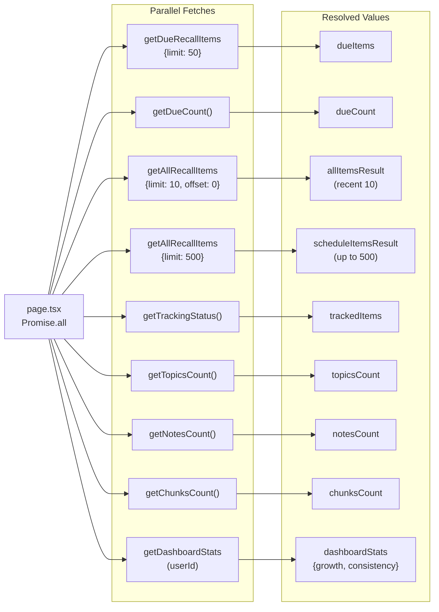
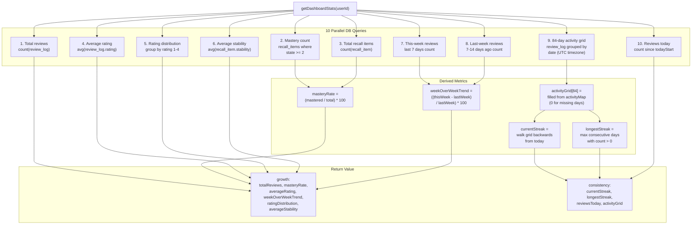
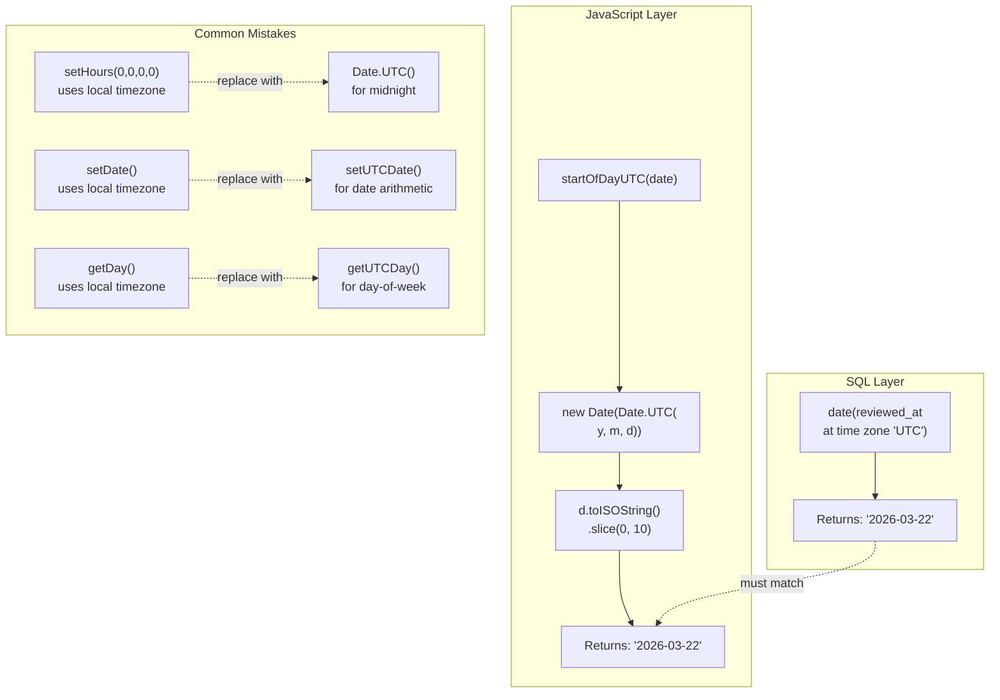
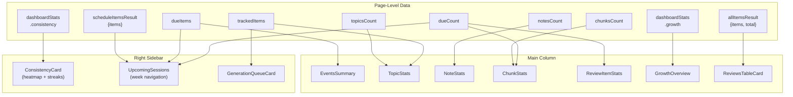

# Dashboard Data Pipeline

## 1. Data Fetching Overview

The dashboard overview page runs 9 parallel fetches via `Promise.all`. The `getDashboardStats` call is conditional on having a logged-in user and itself runs 10 internal parallel DB queries.

## 2. getDashboardStats Internal Queries

The `getDashboardStats` function runs 10 DB queries in a single `Promise.all`, then derives higher-level metrics from the raw results.

## 3. UTC Date Alignment

The activity grid SQL uses `at time zone 'UTC'` for date grouping. JavaScript must use UTC methods to produce matching date strings, otherwise streak calculations and heatmap rendering break for users in non-UTC timezones.

**Key rule:** Every date comparison between SQL results and JavaScript must go through UTC-only methods. The `startOfDayUTC` helper enforces this for the grid origin, and `setUTCDate` / `getUTCDate` are used for all subsequent arithmetic.

## 4. Component Data Flow

Shows how each resolved value from the page-level `Promise.all` maps to dashboard UI components.

### Component details

| Component | Props | Displays |
|-----------|-------|----------|
| **EventsSummary** | `dueItems` | Count of items due now |
| **TopicStats** | `topicsCount`, `trackedCount` | Total topics, tracked topics |
| **NoteStats** | `notesCount` | Total notes |
| **ChunkStats** | `chunksCount`, `dueCount` | Total chunks, due ratio |
| **ReviewItemStats** | `dueCount` | Due items count |
| **GrowthOverview** | `stats` (growth) | totalReviews, masteryRate, avgRating, ratingDistribution, avgStability, weekOverWeekTrend |
| **ConsistencyCard** | `stats` (consistency) | 84-day heatmap, currentStreak, longestStreak, reviewsToday |
| **ReviewsTableCard** | `items`, `total` | Paginated recall items table |
| **UpcomingSessions** | `allItems`, `dueItems`, `dueCount` | Week calendar with scheduled/past reviews |
| **GenerationQueueCard** | `initialItems` | Active tracking/generation queue |

## Key Source Files

| File | Purpose |
|------|---------|
| `apps/web/src/app/dashboard/(overview)/page.tsx` | Parallel data fetching, layout composition |
| `apps/web/src/lib/fetchers/dashboard-stats.ts` | `getDashboardStats` -- 10 parallel queries, UTC handling, streak computation |
| `apps/web/src/app/dashboard/_components/consistency-card.tsx` | 84-day heatmap rendering |
| `apps/web/src/app/dashboard/_components/growth-overview.tsx` | Growth stats display (ratings, mastery, stability) |
| `apps/web/src/app/dashboard/_components/upcoming-sessions.tsx` | Week navigation, past review log display |
