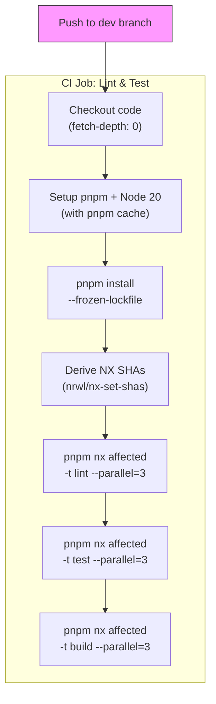
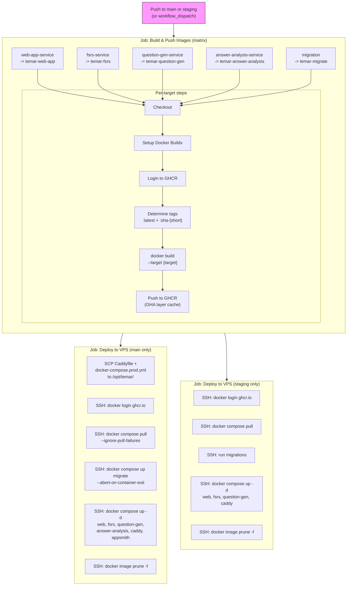
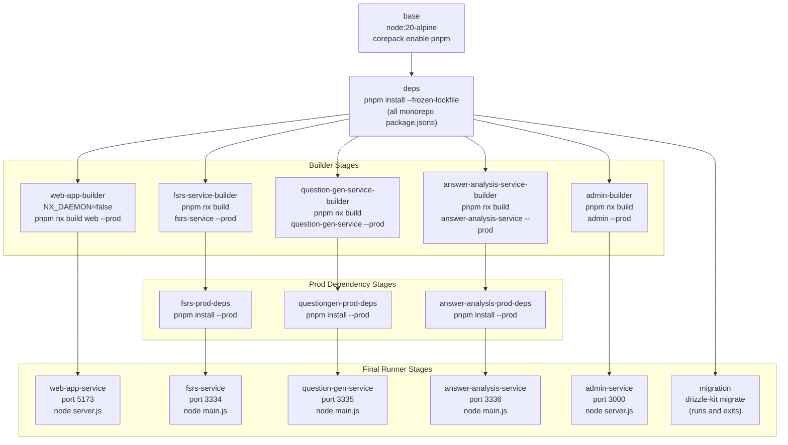
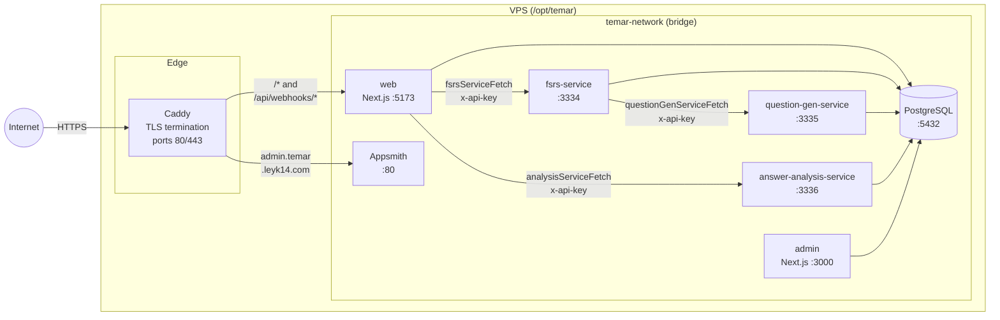

# CI/CD & Deployment

## 1. CI Pipeline

Triggered on every push to the `dev` branch. Uses Nx `affected` to only lint, test, and build projects changed since the last successful CI run.

**Key details:**
- Concurrency group `ci-${{ github.ref }}` with `cancel-in-progress: true` -- newer pushes cancel stale runs
- `fetch-depth: 0` required for Nx affected comparison against base SHA
- `NODE_OPTIONS: "--stack-trace-limit=100"` set on the build step for debugging

## 2. Deploy Pipeline

Triggered on push to `main` or `staging`, plus manual `workflow_dispatch`. Builds Docker images in a matrix, then deploys to the VPS.

**Key details:**
- Concurrency group `deploy-${{ github.ref_name }}` with `cancel-in-progress: false` -- deploys never cancel mid-flight
- Image tags: `:latest` (main) or `:staging` (staging branch) + `:sha-{7char}`
- GHA cache scoped per image name (`cache-from: type=gha,scope=${{ matrix.image_name }}`)
- Migration runs as a one-shot container (`--abort-on-container-exit`) before services start

## 3. Dockerfile Multi-Stage Architecture

All services share a single `Dockerfile` with a multi-stage dependency tree. Each final stage is a minimal production image.

### Builder stage gotchas

| Technique | Why |
|-----------|-----|
| `rm -rf node_modules/@temar` | Forces webpack to resolve `@temar/*` via `tsconfig.base.json` path aliases instead of pnpm workspace symlinks |
| `rm -rf libs/*/tsconfig*.json` | Prevents NestJS builder from honoring `composite: true` in lib tsconfigs, which breaks webpack resolution |
| `NX_DAEMON=false` | Docker builds cannot run a background Nx daemon process |
| Next.js `output: 'standalone'` | Produces minimal bundle, but `public/` and `.next/static` must be manually copied to the runner stage |
| Separate prod-deps stages | NestJS runners need `node_modules` (unlike Next.js standalone); a dedicated stage installs only production deps from the built `package.json` |

## 4. Production Infrastructure

All containers run on a single VPS behind Caddy, connected via a Docker bridge network.

### Caddy routing rules

| Rule | Target | Purpose |
|------|--------|---------|
| `/api/webhooks/*` | `web:5173` | Payment provider webhook endpoints |
| `/*` (default) | `web:5173` | All other web traffic |
| `admin.temar.leyk14.com` | `appsmith:80` | Admin/analytics panel |

### Service communication

All inter-service calls are server-side HTTP REST with `x-api-key` headers. Services are **never** exposed to the internet -- only Caddy's ports 80/443 are published. Services reach each other by Docker DNS names (`web`, `fsrs-service`, etc.) on the `temar-network` bridge.

### Database access

All services connect to PostgreSQL via the `temar-network` bridge. The `db` service exposes port 5432 only to the Docker network (host port mapping configurable via `DATABASE_PORT` env var). Health checks ensure services don't start until PostgreSQL is ready.

## Key Source Files

| File | Purpose |
|------|---------|
| `.github/workflows/ci.yml` | CI workflow (lint, test, build on `dev`) |
| `.github/workflows/deploy.yml` | Deploy workflow (build images, push to GHCR, deploy to VPS) |
| `Dockerfile` | Multi-stage build for all services |
| `docker-compose.prod.yml` | Production compose (all services + Caddy + PostgreSQL) |
| `docker-compose.dev.yml` | Local development compose |
| `Caddyfile` | Reverse proxy configuration + TLS |
| `tsconfig.base.json` | Path aliases that Docker builds depend on |
